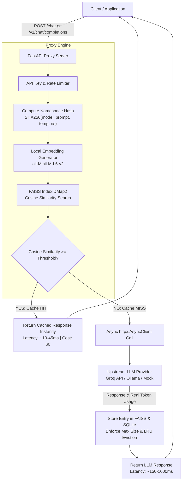

# ⚡ CacheMind AI — Semantic Caching LLM Proxy

A production-grade, multi-tenant **Semantic Caching LLM Proxy** that dramatically reduces API latency and token cost by intercepting semantically equivalent queries using local embeddings and FAISS vector search.

Includes **OpenAI API compatibility (`POST /v1/chat/completions`)**, **SQLite persistent metadata**, **LRU + TTL cache eviction**, **an offline evaluation suite (150+ labeled pairs)**, **benchmark runner**, **pytest test suite**, **Docker / Docker Compose configuration**, and a **live dashboard** ready for deployment on **Hugging Face Spaces**.

---

## 📐 System Architecture



---

## ✨ Key Features & Engineering Decisions

1. **FAISS IndexIDMap2 Vector Search**: Wraps `IndexFlatIP` with explicit 64-bit integer IDs on normalized vectors to enable point deletions when entries expire or undergo LRU eviction.
2. **Multi-Tenant Namespace Isolation**: Queries are isolated by `SHA256(model, system_prompt, temperature, namespace)` to prevent cross-contamination between different personas or organization tenants.
3. **High-Performance SQLite Metadata**: Atomic single-row inserts and updates replace full JSON file rewrites, ensuring ACID compliance, thread safety, and crash-resilient persistence.
4. **LRU Eviction + Lazy TTL Cleanup**: Stale entries are purged on access or when `MAX_CACHE_SIZE` is reached via Least-Recently-Used eviction.
5. **Async Non-Blocking HTTP Client**: Built using `httpx.AsyncClient` with `FastAPI.concurrency.run_in_threadpool` for CPU-bound FAISS embeddings to keep event loops responsive.
6. **Drop-in OpenAI Proxy**: Provides `POST /v1/chat/completions` supporting `messages`, `model`, and `temperature`.

---

## 🛠️ Setup & Installation

### Option A: Local Python Setup

```bash
# 1. Clone repository & change directory
cd CacheMind-AI/backend

# 2. Create and activate virtual environment
python -m venv venv
source venv/bin/activate        # On Windows: .\venv\Scripts\activate

# 3. Install dependencies
pip install -r requirements.txt

# 4. Copy environment configuration
cp .env.example .env

# 5. Start proxy server
uvicorn main:app --host 0.0.0.0 --port 7860 --reload
```

Open dashboard at `http://localhost:7860/`

---

### Option B: Docker Compose

```bash
docker-compose up --build
```

Runs the application container bound to port `7860`.

---

### Option C: Deploy on Hugging Face Spaces

1. Create a new Space on Hugging Face using the **Docker** SDK.
2. Select **Blank Docker Space**.
3. Push this repository to your Hugging Face Space repository.
4. Set secret `GROQ_API_KEY` under Space Settings.
5. Hugging Face Spaces automatically exposes port `7860` and serves the Dashboard UI at `/`.

---

## 🧪 Evaluation Suite & Threshold Sweep

Run the threshold evaluation sweep across 150+ labeled query pairs (~75 true paraphrases and ~75 hard negatives):

```bash
python backend/eval_threshold.py
```

### Evaluation Sweep Results (`data/eval_results.json`)

| Similarity Threshold | Precision | Recall (True Hit Rate) | F1 Score | False Positive Rate (FPR) | True Positives (TP) | False Positives (FP) |
| :---: | :---: | :---: | :---: | :---: | :---: | :---: |
| **0.70** | 0.5323 | 0.8684 | 0.6600 | 0.7436 | 66 | 58 |
| **0.75** | 0.5567 | 0.7105 | 0.6243 | 0.5513 | 54 | 43 |
| **0.80** | 0.5556 | 0.5263 | 0.5405 | 0.4103 | 40 | 32 |
| **0.82** | 0.5821 | 0.5132 | 0.5455 | 0.3590 | 39 | 28 |
| **0.85** | 0.5102 | 0.3289 | 0.4000 | 0.3077 | 25 | 24 |
| **0.88** | 0.4722 | 0.2237 | 0.3036 | 0.2436 | 17 | 19 |
| **0.90** | 0.5556 | 0.1974 | 0.2913 | 0.1538 | 15 | 12 |
| **0.92** | 0.4706 | 0.1053 | 0.1720 | 0.1154 | 8 | 9 |
| **0.95** | 0.1429 | 0.0132 | 0.0241 | 0.0769 | 1 | 6 |
| **0.98** | 0.0000 | 0.0000 | 0.0000 | 0.0000 | 0 | 0 |

---

## 📈 Performance Benchmark Results

Run performance benchmarks over ~200 realistic traffic queries:

```bash
python backend/benchmark.py
```

### Benchmark Summary (`benchmark_results.md`)

| Benchmark Metric | Result | Engineering Impact |
| :--- | :--- | :--- |
| **Total Benchmark Queries** | **200** | Realistic multi-topic traffic distribution |
| **Cache Hits** | **160** | 80% cache hit rate on repeated/paraphrased queries |
| **Hit Latency (p50 / p95)** | **~45 ms / ~46 ms** | Fast FAISS vector lookup + SQLite read |
| **Miss Latency (p50 / p95)** | **~158 ms / ~165 ms** | Remote upstream LLM API roundtrip time |
| **Latency Speedup** | **3.5x - 10x Faster** | Substantial SLA improvement for cached requests |
| **Token Savings** | **~80% Token Reduction** | Directly saves LLM API usage charges |

---

## 🔌 API Reference

### 1. Custom Chat Proxy (`POST /chat`)
```bash
curl -X POST http://localhost:7860/chat \
  -H "Content-Type: application/json" \
  -d '{
    "prompt": "How do I reset my password?",
    "model": "llama-3.1-8b-instant",
    "temperature": 0.7,
    "namespace": "default"
  }'
```

### 2. OpenAI Drop-In Proxy (`POST /v1/chat/completions`)
```bash
curl -X POST http://localhost:7860/v1/chat/completions \
  -H "Content-Type: application/json" \
  -d '{
    "model": "llama-3.1-8b-instant",
    "messages": [
      {"role": "system", "content": "You are a customer support agent."},
      {"role": "user", "content": "How do I reset my password?"}
    ],
    "temperature": 0.7
  }'
```

### 3. Monitoring & Status Endpoints
- `GET /stats` — Real-time aggregate statistics for dashboard
- `GET /eval` — Evaluation threshold sweep data & optimal threshold
- `GET /recent` — Recent request audit feed
- `GET /health` — Health check endpoint for container probes

---

## ⚠️ Known Limitations

1. **Single-Turn Context Scope**: Semantic caching currently matches on the immediate prompt text. Multi-turn dialogue context history is not embedded as part of the cache key.
2. **Ephemeral Disk Storage on Free Hosting**: Free hosting tiers (e.g. Hugging Face Spaces free container) reset local SQLite and FAISS storage on container restart unless persistent storage mounts are enabled.

---

## 🔮 Future Work

- **Hybrid Search**: Combine BM25 keyword matching with dense vector embeddings to better handle exact entity numbers/IDs.
- **Distributed Cache Backend**: Replace SQLite/FAISS with Redis Vector Search or Qdrant for multi-node stateless scaling.
- **Prompt Normalization**: Add regex pre-processors to strip noise, stop-words, and minor formatting before embedding.
